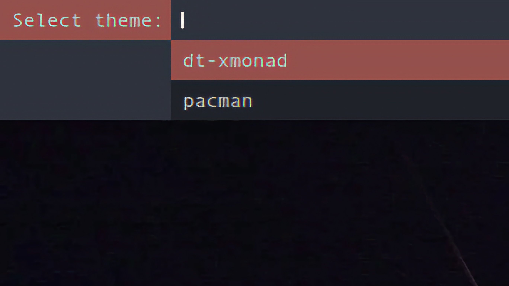
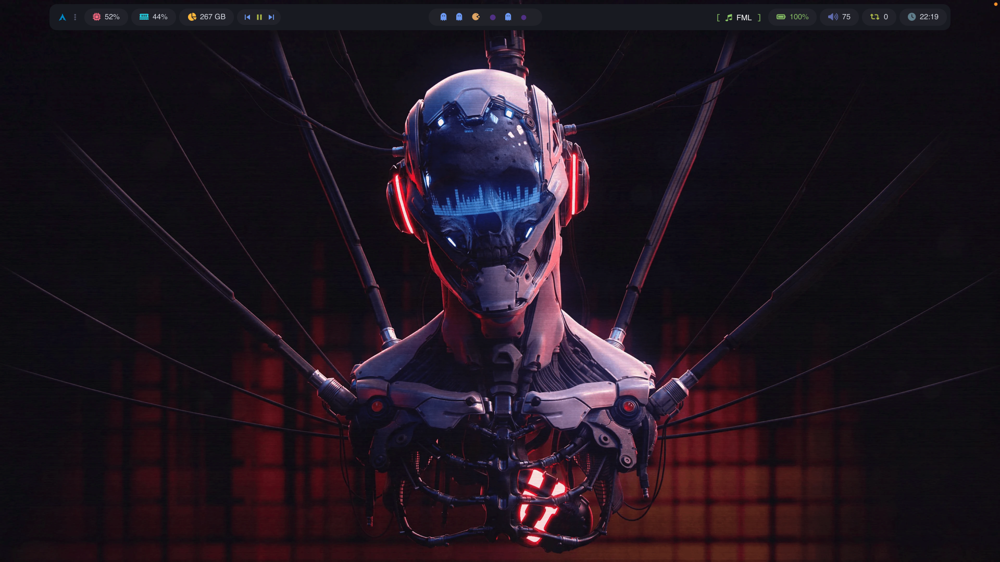
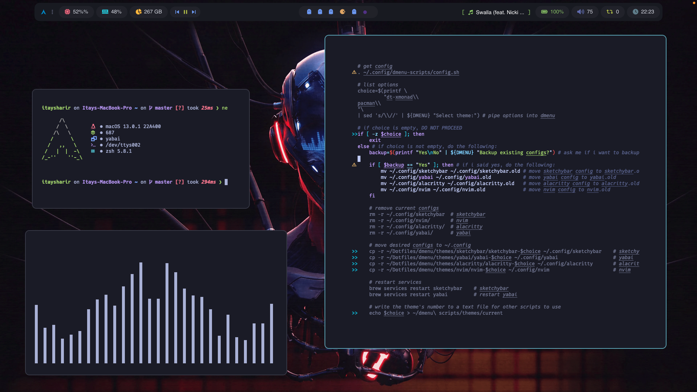
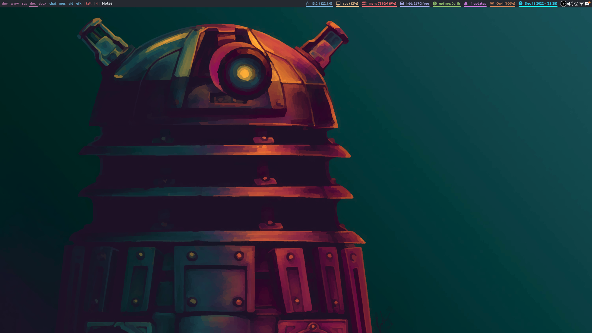
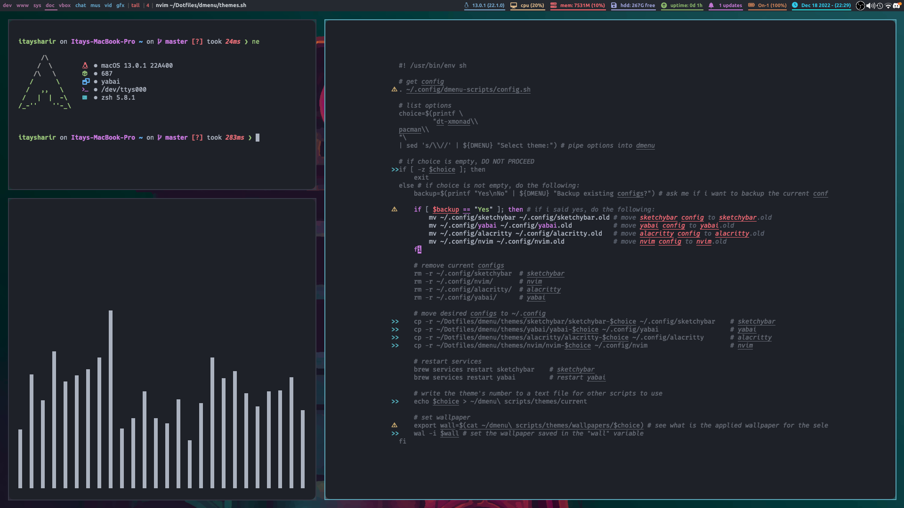

# Dotfiles | macOS themes collection

## 🏓 Introduction
I'm Itay, a 12 y/o kid from israel, and i love making my computer look and behave just like i want it to. These are my Dotfiles, with 2 themes. Enjoy! <br>

[watch](https://user-images.githubusercontent.com/87126382/208316922-5e40e95a-5ce8-4d09-afd7-1add83b876a8.mp4)

## 🌃 Dmenu script for switching between themes


|OS|macOS (Ventura, 13.1)|
|:---:|:---:|
|WM|[yabai](https://github.com/koekeishiya/yabai)|
|Bar|[sketchybar](https://github.com/FelixKratz/SketchyBar)|
|Menu|[Dmenu](https://tools.suckless.org/dmenu/)|
|Terminal|[alacritty](https://github.com/alacritty/alacritty)|

## 🚀 Why are my Dotfiles different than (most) others?
- 2 different themes instead of 1
- A dmenu script to easily switch between these themes
- Speaking of dmenu, my Dotfiles have 7 other dmenu scripts for you to explore and use!

<table align="center">
   <tr>
      <th align="center">
         <sup><sub>:warning: WARNING :warning:</sub></sup>
      </th>
   </tr>
   <tr>
      <td align="center">
      
      I USE AN M1 MACBOOK PRO FROM LATE 2020, I DON'T KNOW
      HOW WELL MY DOTFILES ARE GONNA WORK ON OTHER MACHINES.
     
   </tr>
   </table>
   
## 🏜️ The themes
### 🕹️Pacman:
|||
|---|---|

### 🎤 DT’s Xmonad:
|||
|---|---|

## 🎯 Setup
To install my Dotfiles, i made an easy install script. To use it, run the following command. <br>
```curl https://raw.githubusercontent.com/itaysharir/Dotfiles/main/install.sh | sh```

## 📦 Manual Setup - Themes
### Install dependencies
- If you don't have brew installed, obviously install it
```
if ! command -v brew &> /dev/null
then
   /bin/bash -c "$(curl -fsSL https://raw.githubusercontent.com/Homebrew/install/HEAD/install.sh)"
else
   echo "brew is already installed, you're set."
fi
```
- Install the rest of the dependencies
```
# programs
brew tap FelixKratz/formulae
brew install sketchybar
brew install koekeishiya/formulae/yabai
brew install koekeishiya/formulae/skhd
brew install alacritty
brew install jq
sh -c "$(curl -fsSL https://raw.githubusercontent.com/ohmyzsh/ohmyzsh/master/tools/install.sh)"
brew install cava
brew install starship

# fonts
brew tap homebrew/cask-fonts
brew install font-ubuntu
brew install font-fontawesome
brew install font-hack-nerd-font
brew install font-fira-code-nerd-font
brew install --cask font-monocraft

# fonts that aren't avalible in brew
git clone https://github.com/itaysharir/Dotfiles ~/Dotfiles && cd Dotfiles
cd misc/fonts
cp Pacman-Dots.ttf ~/Library/Fonts/Pacman-Dots.ttf
```

### Move files (By default for pacman setup)
```
# theme spacific
cd ~/Dotfiles
cp -r config/rices/Pacman/sketchybar ~/.config/sketchybar
cp -r config/rices/Pacman/yabai ~/.config/yabai
cp -r config/rices/Pacman/skhd ~/.config/skhd
cp -r config/rices/Pacman/alacritty ~/.config/alacritty
cp -r config/rices/Pacman/nvim ~/.config/nvim
cp -r config/rices/Pacman/cava ~/.config/cava

# not theme spacific
cp -r config/dmenu-scripts ~/.config/dmenu-scripts
cp config/zsh/.zshrc ~/.zshrc
cp -r config/zsh/.zsh ~/.zsh
cp config/starship/starship.toml ~/.config/starship.toml
```

### Start services
```
brew sevices start yabai
brew sevices start skhd
brew sevices start sketchybar
```
## 🗳️ Manual Setup - Dmenu
### Install dependencies
- Install macports (the following command is for macos ventura, install manually for other versions)
```
if ! command -v port &> /dev/null
then
   brew install wget
   wget https://github.com/macports/macports-base/releases/download/v2.8.0/MacPorts-2.8.0-13-Ventura.pkg
   open MacPorts-2.8.0-13-Ventura.pkg
   echo "_________"
   echo ""
   echo "Follow the instructions on-screen to install macports"
else
   echo "macports is already installed, you're set."
fi
```
- Install dependencies for dmenu (on mac) with macports (This procces is going to take some time, **DO NOT** cancel the installation in the middle)
```
sudo port install dmenu
sudo port uninstall dmenu
# installing and then uninstalling right away might seem pointless, but this way all dependencies are installed.
```

- Install dependencies for the wallpaper script
```
sudo port install sxiv # image viewer
# pywal fork
sudo pip3 uninstall pywal; sudo rm $(which wal) # if pywal is installed, remove it
git clone https://github.com/robwaz/pywal && cd pywal
sudo pip3 install -e ./ # build
```
### Install my build of dmenu
- If you didn't follow the instructions in "Setup - Themes", run the following:
```
brew install koekeishiya/formulae/skhd
git clone https://github.com/itaysharir/Dotfiles ~/Dotfiles
cd Dotfiles
cp -r config/rices/Pacman/skhd ~/.config/skhd
```
- Now cd into dmenu/dmenu-4.9 and compile
```
cd dmenu/dmenu-4.9
sudo make install
brew services restart skhd
```
- Reboot
- Now dmenu and the scripts are installed. If you've followed all above instructions, you should be able to hit ```cmd + shift + return``` to open the dmenu script that launches apps. See my skhd config for additional keyblindings. 

## 🕸 Troubleshooting
If Xquartz crashes immediately after hitting the keyblindings or running dmenu, remove ~/.xinitrc
```mv ~/.xinitrc ~/.xinitrc.backup```

## 😁 Credits
- Obviously, DT. I took HUGE insporation for the "DT's Xmonad" theme from your xmobar & xmonad configs.
- [gh0stzk](https://github.com/gh0stzk/dotfiles) I also took HUGE inspotations from your Emilia theme for my "Pacman" theme. I also completly ripped off your README.md design
