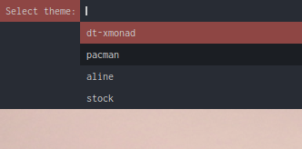

# Dotfiles | macOS themes collection

## 🏓 Introduction
I'm Itay, a 12 y/o kid from israel, and i love making my computer look and behave just like i want it to. These are my Dotfiles, with 2 themes. Enjoy! <br>

[watch](https://user-images.githubusercontent.com/87126382/208316922-5e40e95a-5ce8-4d09-afd7-1add83b876a8.mp4)

## 🌃 Dmenu script for switching between themes


|OS|macOS (Ventura, 13.1)|
|:---:|:---:|
|WM|[yabai](https://github.com/koekeishiya/yabai)|
|Bar|[sketchybar](https://github.com/FelixKratz/SketchyBar)|
|Menu|[Dmenu](https://tools.suckless.org/dmenu/)|
|Terminal|[alacritty](https://github.com/alacritty/alacritty)|

## 🚀 Why are my Dotfiles different than (most) others?
- 2 different themes instead of 1
- A dmenu script to easily switch between these themes
- Speaking of dmenu, my Dotfiles have 7 other dmenu scripts for you to explore and use!

<table align="center">
   <tr>
      <th align="center">
         <sup><sub>:warning: WARNING :warning:</sub></sup>
      </th>
   </tr>
   <tr>
      <td align="center">
      
      I USE AN M1 MACBOOK PRO FROM LATE 2020, I DON'T KNOW
      HOW WELL MY DOTFILES ARE GONNA WORK ON OTHER MACHINES.
     
   </tr>
   </table>
   
## 🏜️ The themes
### 🕹️Pacman:
|||
|---|---|

### 🎤 DT’s Xmonad:
|||
|---|---|

## 📦 Setup
### Install dependencies
```
# programs
brew tap FelixKratz/formulae
brew install sketchybar
brew install koekeishiya/formulae/yabai
brew install koekeishiya/formulae/skhd
brew install alacritty
brew install jq
sh -c "$(curl -fsSL https://raw.githubusercontent.com/ohmyzsh/ohmyzsh/master/tools/install.sh)"
brew instal tmux
brew install cava

# fonts
brew tap homebrew/cask-fonts
brew install font-ubuntu
brew install font-fontawesome
brew install font-hack-nerd-font
brew install font-fira-code-nerd-font

# fonts that aren't avalible in brew
echo "The script is going to install fonts that aren't avalible in homebrew, a popup is goins to open and you'll need to click install."
sleep 1

git clone https://github.com/itaysharir/Dotfiles ~/Dotfiles && cd Dotfiles
cd misc/fonts
open Pacman-Dots.ttf
echo " "
echo "__________"
echo " "
echo "Click install on the prompt that opened up"
```

### Move files (By default for pacman setup)
```
# theme spacific
cd ~/Dotfiles
mv -r config/Pacman/sketchybar ~/.config/sketchybar
mv -r config/Pacman/yabai ~/.config/yabai
mv -r config/Pacman/skhd ~/.config/skhd
mv -r config/Pacman/alacritty ~/.config/alacritty
mv -r config/Pacman/cava ~/.config/cava

# not theme spacific
mv -r misc/nvim ~/.config/nvim
mv misc/zsh/.zshrc ~/.zshrc
mv misc/starship/starship.toml ~/.config/starship.toml
mv misc/tmux/.tmux.conf ~/.tmux.conf
```

### Start services
```
brew sevices start yabai
brew sevices start skhd
brew sevices start sketchybar
```

## 😁 Credits
- Obviously, DT. I took HUGE insporation for the "DT's Xmonad" theme from your xmobar & xmonad configs.
- [gh0stzk](https://github.com/gh0stzk/dotfiles) I also took HUGE inspotations from your Emilia theme for my "Pacman" theme. I also completly ripped off your README.md design
